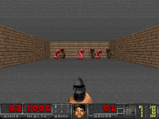

## About

This repository implements a deep Q network inspired by the one developed by Mnih et al. (2015). I have always found the idea of machines learning to play games interesting, so this project was a natural choice. Rather than play Atari games, like in the original paper, I decided to make a network learn a somewhat more visually complex game, Doom.

### Prerequisites

This code relies on [ViZDoom](http://vizdoom.cs.put.edu.pl/), which can be installed via pip, as well as PyTorch.

### Scenario

The input space consists of a 320 by 240 RGB pixel screen. The action space consists of three discrete options: turn left, turn right, and attack. The goal is to kill as many enemies as possible. There are three melee-only and three ranged enemies, all of which respawn with more health soon after being killed.

(Doom's art is not public domain, so ViZDoom comes with different images. You can replace them if you own an original copy of Doom, but I chose to use the default ViZDoom art, since it shouldn't make much of a difference to the agent.)

## Quick background

Reinforcement learning is a large topic, and the implementation here rests on a lot of theory and background - far more than it would be reasonable to put in a readme. I highly recommend Sutton and Barto's textbook if you'd like to know more about the theory or the details of how this technique works. However, I think it's worth giving a brief rundown of the theory behind the code.

### Q learning

Q learning is a method of reinforcement learning that doesn't require knowing anything about how actions affect the world, which makes it broadly applicable. In its simplest form, it uses a table to track how effective its actions have been at getting positive outcomes. Frequently, the value is modified such that rewards in the near future are treated as more valuable than those in the far future, but for games as short as the Doom minigame used here, this isn't particularly important.

### Deep Q learning

Of course, filling out (or even storing) a table only works if there are a reasonable number of possible states, which is not the case when the state space contains images. In cases like this, it's necessary to use some sort of compact approximation. One natural fit is a neural network. We can train a network to take in a representation of the state and output how good it thinks it would be to take each action (there are alternative ways of performing function approximation or structuring a network that calculates these values, but this arrangement is particularly efficient).

## Network design

The network design very roughly follows that of Mnih et al. However, because a Doom screen is much larger and more complex than an Atari one, some alterations were required. Following the first convolution, the heights and widths of the activation maps are halved with a max pooling layer to make the problem more tractable. Using this with the default convolutions would result in dropping pixels on the right and bottom of the screen due to intermediate dimensions not being cleanly divisible by the kernel size. Rather than allowing this, I padded before the first two convolutions to keep the maps completely divisible by the relevant integers. The final two layers are fully connected to allow integration of global information.

I used leaky rectified linear units in between most layers because ReLUs are fast and leaky ones avoid some problems at a trivial increase in computation. The final layer has no activation, as its goal is to predict the reward of each action.

Rather than being fed direct RGB input, I reduced computational burden and gave the agent some sense of temporality by converting frames to grayscale and then stacking four on top of each other. For this scenario, converting to grayscale by summing the pixel values and then normalizing to [-1, 1] was sufficient.

The table below describes the network. Note that PyTorch actually uses CHW order, but this table presents dimensions in HWC.

| Layer | Input | Filters | Kernel size | Stride | Padding | Output |
| :-: | :-: | :-: | :-: | :-: | :-: | :-: |
| Convolution | 320x240x4 | 32 | 8 | 4 | 2 | 80x60x32 |
| Max pool | 80x60x32 |  | 2 | 2 | 0 | 40x30x32 |
| Leaky ReLU | | | | | | |
| Convolution | 40x30x32 | 64 | 4 | 2 | 1 | 20x15x64 |
| Leaky ReLU | | | | | | |
| Convolution | 20x15x64 | 64 | 3 | 1 | 0 | 18x13x64 |
| Leaky ReLU | | | | | | |
| Fully connected | 18x13x64 = 14976 |  |  |  |  | 512 |
| Leaky ReLU | | | | | | |
| Fully connected | 512 |  |  |  |  | 3 |

### Target network

When an action is taken and the game advanced, Q learning uses the estimate of the value of the new state to update the estimated value of the previous state. However, doing this with function approximation raises an interesting issue: altering the approximator can (and does) alter the estimated value of the new state. Since this value is what the alteration is based on, these updates can be unstable. A surprisingly effective solution is to use a target network to generate the estimated value of the next state. This target network does not change for most steps, allowing the actual Q network to have stable and consistent updates. Of course, as the Q network learns to estimate the value of an action better, we want the target network to integrate this knowledge, so every few thousand steps the Q network is copied into the target network. This simple trick drastically improves learning.

### Replay buffer

Correlated updates can cause problems with learning. This is true for all neural networks. In supervised learning, it's fairly easy to avoid this by shuffling training data. It's less obvious what to do in the case of reinforcement learning, where an agent experiences temporally meaningful sequences of states. Mnih et al. solved this with a replay buffer. Rather than training on data as it comes in, the network stores its experiences and actions in a circular buffer. Data is drawn from this buffer at random in order to decorrelate updates. An additional advantage to this technique is that it allows easy batching, providing even more stability.

### Hyperparameters

The network was trained using Torch's default Adam optimizer and batches of size 32. Epsilon-greedy exploration was used, with epsilon decaying linearly from 1 to 0.1 over 1,000,000 frames. The discount factor was 0.99.

## Running the code

Invoke the code with "python main.py \<mode\> \<name\> \<value\>", where mode is either eval or train (to evaluate or train a network, respectively), name is a string used to identify the network, and value is any positive integer (and defines the number of episodes to evaluate/train over). The name must be legal for filepaths, as it is used to save and load the network. If value is not given or is invalid, it's set to 10 for eval mode and 10,000 for train mode.

## References

Mnih, V., Kavukcuoglu, K., Silver, D., Rusu, A. A., Veness, J., Bellemare, M. G., ... & Hassabis, D. (2015). Human-level control through deep reinforcement learning. nature, 518(7540), 529-533.

Sutton, R. S., & Barto, A. G. (2018). Reinforcement learning: An introduction. MIT press.
